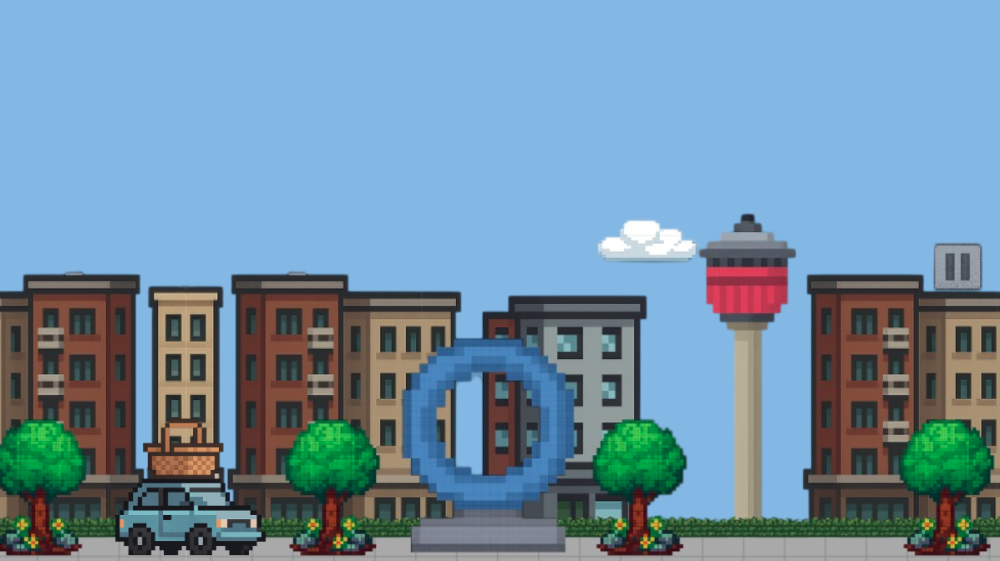

# 🚗 District Driver

An engaging web-based arcade game where players drive through an urban landscape catching falling merchandise while avoiding obstacles.

## 🎮 Game Description

District Driver is a fun, fast-paced arcade game set in Calgary's University District. Players control a car that must catch falling items representing local businesses while avoiding hazardous obstacles. Players who achieve a high score of 200+ points can earn a special 5% discount at participating University District shops.

## 🕹️ How to Play

### Controls
- **Arrow Keys** or **WASD**: Move your car in all directions
- **Shift**: Activate speed boost
- **Escape**: Pause the game
- **R**: Restart the game

### Gameplay
1. Catch falling merchandise items to earn 10 points each
2. Avoid obstacles like spike balls and hail stones
3. Each collision with an obstacle costs one life
4. Score 200+ points to unlock a special 5% discount reward

## 🚙 Vehicle Selection

Choose from 9 different cars, each with unique characteristics:

- **Peppy**: Zippy and cheerful. Always late, always fast.
- **Rusty**: Faded paint, full of charm. Might stall, might win.
- **Turbo**: Aggressive and loud. Probably drinks energy drinks.
- **Drift**: Calm under pressure. The road bends to him.
- **Blazer**: Burnouts and bravado. Doesn't know what subtle means.
- **Boss**: Rich, square, and rolling deep. Power in every pixel.
- **Crawler**: Tougher than a two-dollar steak. Climbs curbs like mountains.
- **Bugsy**: Short-tempered, loud engine. Always parks crooked.
- **Phantom**: Quick, elusive, and always one step ahead. You don't chase it—you follow its tail lights.

## 🎵 Audio Features

The game features a dynamic audio system:

- **Procedurally Generated Background Music**: Enjoy a continuously evolving soundtrack with a 2-minute loop featuring different musical sections (Intro → Verse → Chorus → Bridge → Chorus → Outro)
- **Sound Effects**: Collect items, hit obstacles, and start/end games with custom audio cues
- **Audio Controls**: Toggle music and sound effects on/off using the control panel

## 🛠️ Technical Features

This game showcases several technical achievements:

- **Canvas-based Rendering**: High-performance 2D graphics using HTML5 Canvas
- **Procedural Background Generation**: Seamless infinite scrolling with parallax effect
- **Web Audio API Integration**: Dynamic music generation and sound effects
- **Responsive Design**: Adapts to different screen sizes
- **Local Storage**: Saves high scores between sessions
- **Collision Detection**: Accurate hit detection system
- **Animation System**: Smooth sprite animations with damage effects

## 🏆 Rewards System

Players who score 200+ points unlock a special reward:

- 5% discount at participating University District businesses
- Discount is valid until April 30, 2025
- Visual confirmation with trophy emoji and special UI flourish

## 💻 Development

### Technologies Used

- React/TypeScript for frontend
- Canvas API for rendering
- Web Audio API for sound generation
- Local Storage for data persistence

### Project Structure

- `client/src/components/game/DropGame.tsx`: Main game loop and mechanics
- `client/src/components/game/Background.tsx`: Scrolling background implementation
- `client/src/hooks/use-sound.ts`: Audio system with procedural music generation
- `client/src/components/GameContainer.tsx`: Game container and controls

### Running Locally

1. Clone the repository
2. Install dependencies with `npm install`
3. Start the development server with `npm run dev`
4. Open your browser to the displayed URL

## 🔮 Future Enhancements

- Additional vehicle options
- More challenging levels
- Mobile touch controls
- Online leaderboard
- More reward tiers

---

Developed with ❤️ for the University District community.